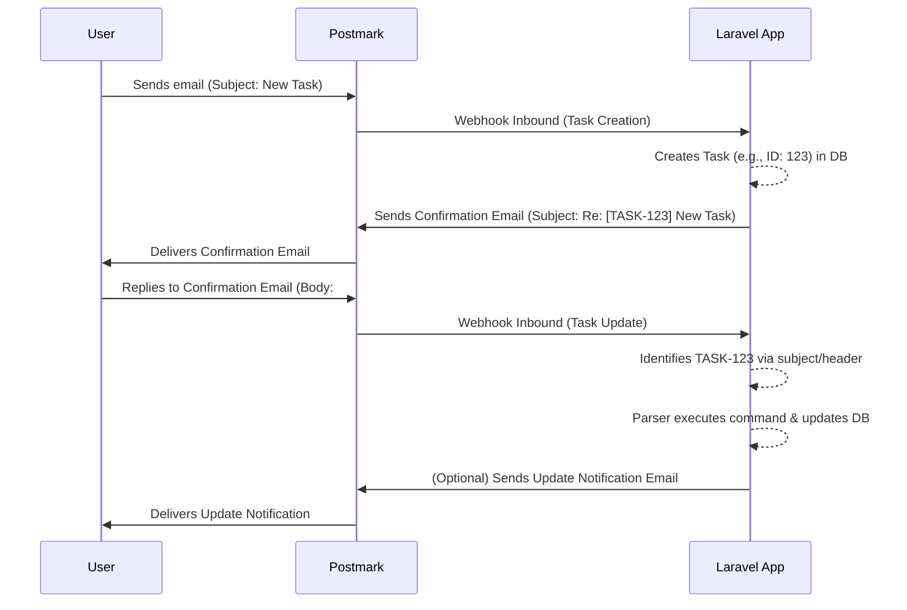

# 📧 Conversational Email Task Manager

[](https://php.net)
[](https://laravel.com)
[](https://livewire.laravel.com)
[](https://www.sqlite.org/index.html)
[](https://pestphp.com/)
[](https://postmarkapp.com)


This project is a submission for the **Postmark Challenge: Inbox Innovators**. The goal is to develop a web application that allows users to create and manage tasks entirely through their email clients. The application transforms email into a conversational interface, where tasks are created with an initial email and updated through replies in the same thread.

The innovative factor is the implementation of a feedback cycle ("send and interact") rather than a unidirectional data entry ("send and forget"). Users can manage the complete lifecycle of a task without leaving their inbox, making the process more fluid and integrated into their daily workflow.


## ✨ Features

*   **Create Tasks via Email:** Send an email to a designated address (e.g., `tasks@yourapp.com`). The subject becomes the task title, and the body becomes the description.
*   **Interactive Confirmation Replies:** Receive an automated email reply after task creation. This email includes a unique task identifier in the subject (e.g., `Re: [TASK-123] Task Title`) and clear instructions on how to interact with the task using commands.
*   **Update Tasks by Replying:** Update existing tasks by replying to the confirmation email. The system identifies the corresponding task and processes commands in the reply body.
*   **Command Parser:** Interpret specific commands in the email body, such as:
    *   `#priority <high|medium|low>`
    *   `#complete`
    *   `#comment <your comment text>`
    *   `#due <YYYY-MM-DD>`
*   **Sender Authentication:** Tasks are associated with the sender's email (`from_email`). Only the original sender can modify a task.
*   **Web Interface:** A simple web page lists all received tasks, displaying title, description, priority, status, and creator's email.

## 🛠️ Tech Stack

*   **Backend:** Laravel 12
*   **Frontend:** Blade (with Livewire for dynamic task list)
*   **Database:** SQLite (for development and submission simplicity)
*   **Email Service:** Postmark (Inbound and Outbound APIs)
*   **Local Tunnel:** Ngrok (or similar, to expose the local application to Postmark webhooks during development)
*   **Testing:** Pest (PHP Testing Framework)

## 🚀 How to Run Locally

1.  **Clone the repository:**
    ```bash
    git clone https://github.com/your-username/your-repository-name.git
    cd your-repository-name
    ```

2.  **Install dependencies:**
    ```bash
    composer install
    ```

3.  **Set up your environment file:**
    ```bash
    cp .env.example .env
    ```

4.  **Generate an application key:**
    ```bash
    php artisan key:generate
    ```

5.  **Run database migrations:**
    (This will also create the `database.sqlite` file if it doesn't exist)
    ```bash
    php artisan migrate
    ```

6.  **Configure `.env` variables:**
    Update your `.env` file with your Postmark API credentials:
    ```env
    POSTMARK_TOKEN=YOUR_POSTMARK_SERVER_API_TOKEN
    POSTMARK_MAILER_DSN=postmark+api://YOUR_POSTMARK_SERVER_API_TOKEN@default
    MAIL_FROM_ADDRESS=your-verified-sender@example.com
    MAIL_FROM_NAME="${APP_NAME}"

    # This is the address your app will receive emails at for task creation/updates
    # Ensure this is configured in your Postmark Inbound Stream settings
    POSTMARK_INBOUND_EMAIL=tasks@yourdomain.com
    ```
    *   `POSTMARK_TOKEN`: Your Postmark Server API Token.
    *   `POSTMARK_MAILER_DSN`: Your Postmark DSN for sending emails.
    *   `MAIL_FROM_ADDRESS`: A verified sender signature in Postmark.
    *   `POSTMARK_INBOUND_EMAIL`: The email address configured in your Postmark Inbound Stream to forward emails to your application's webhook.

7.  **Set up a webhook tunnel (e.g., Ngrok):**
    Expose your local server to the internet. For example, if your app runs on `http://localhost:8000`:
    ```bash
    ngrok http 8000
    ```
    Note the `Forwarding` URL provided by Ngrok (e.g., `https://your-ngrok-subdomain.ngrok-free.app`).

8.  **Configure Postmark Inbound Webhook:**
    *   Go to your Postmark account -> Servers -> Select your server -> Message Streams.
    *   Select your Inbound stream (or create one).
    *   Go to the "Settings" or "Webhooks" tab for that stream.
    *   Add a new webhook pointing to your application's inbound email endpoint: `https://your-ngrok-subdomain.ngrok-free.app/webhook/email-inbound` (replace with your actual Ngrok URL).

9.  **Start the development server:**
    ```bash
    php artisan serve
    ```
    Your application should now be running locally, typically at `http://localhost:8000`.

## 🧪 Running Tests

To run the automated tests (PestPHP):

```bash
php artisan test
```

This will execute all unit and feature tests to ensure the application is working as expected.

## 📊 Project Workflow


